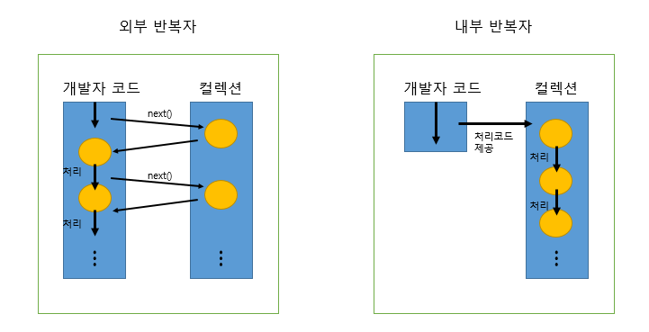
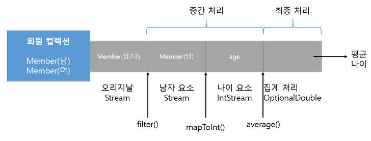
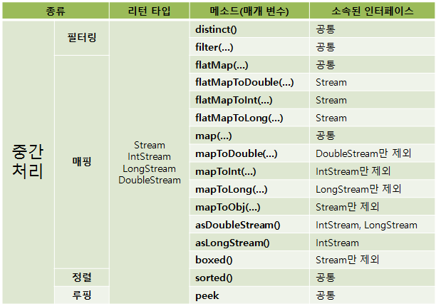

 1. 스트림
	- 자바8부터 추가된 컬렉션의 저장요소를 하나씩 참조해서 람다식으로 처리할 수 있도록 해주는 '반복자'이다.
	
	1) 반복자 스트림
		자바7 이전까지는 Iterator 반복자 사용하여 컬렉션 요소를 순차 처리함.
		이제는 Stream 이용도 가능
	2) 스트림의 특징
		- Steam은 Iterator와 비슷한 역할을 하는 반복자  
		- 둘의 차이점 : 람다식으로 요소처리코드를 제공, 내부 반복자를 사용하므로 병렬처리가 쉬움, 중간처리와 최총처리 작업을 수행.  
		
		* 외부반복자(external iterator)란?  
			개발자가 코드로 직접 컬렉션의 요소를 반복해서 가져오는 코드 패턴을 말함.  
			반면에 내부반복자(internal iterator)는 컬렉션 내부에서 요소들을 반복시키고, 개발자는 요소당 처리해야 할 코드만 제공하는 코드 패턴을 말함.  
			

		- 스트림은 중간처리와 최종처리를 할 수 있다.  
		  중간처리에서는 매핑,필터링, 정렬을 수행하고 최종처리에선 반복, 카운팅, 평균, 총합 등 집계처리를 수행한다.
		 			

2. 스트림의 종류  
	java.util.stream패키지에 Stream API들이 들어있다.  
	
	BaseStream  
		- Stream  
		- DoubleStream  
		- IntStream  
		- LongStream  
		  
		
	1) 컬렉션으로부터 스트림 얻기  
		컬렉션변수.stream();  
	2) 배열로부터 스트림 얻기  
		Arrays.stream(배열);  
	3) 숫자 범위로부터 스트림 얻기  
		IntStream.range(int start, int endExclusive);  
		IntStream.rangeClosed(int start, int endInclusive);  
	파일, 디렉토리는 pass  
 3. 스트림 파이프라인  
	다량의 데이터를 가공해서 축소하는 것을 일반적으로 리덕션이라한다.  
	데이터의 합계, 평균값, 카운팅, 최대값, 최소값 등을 대표적인 리덕션의 결과물이라 한다.  
	컬렉션 요소를 리덕션의 결과물로 바로 집계할 수 없을 경우, 필터링, 매핑, 정렬, 그룹핑등 중간 처리가 필요하다.  
	
	중간처리와 최종처리를 파이프라인으로 해결한다.  
  	파이프라인은 여러 개의 스트림이 연결되어 있는 구조를 말한다.  
	- **[ 메서드 사용 구조 ]**  
		  

	1) **[ 중간처리 메서드 ]**  
		  
		
		1. 필터링 distinct(), filter()  
			중간처리 기능으로 요소를 걸러내는 역할  
			distinct() : 중복제거  
			filter(Predicate / InterPredicate / LongPredicate / DoublePredicate) : 조건 필터링 변수 -> {true / false로 리턴}  
		
		2. 매핑 flapMapXXX(), mapXXX(), asXXXStream(), boxed()  
			중간처리 기능으로 스트림의 요소를 다른 요소로 대체하는 작업을 함.  
		
			1) flapMapXXX()  
				요소를 대체해주는 여러개의 요소들로 구성된 새로운 스트림을 리턴함  
			2) mapXXX()  
				요소를 대체해주는 요소로 구성된 새로운 스트림을 리턴함.  
			3) asXXXStream(), boxed()  
				asDoubleStream() : IntStream의 int, LongStream의 long요소를 double로 변환해 DoubleStream으로 생성해줌  
				asLongStream() : IntStream의 int를 long으로 변환해 LongStream으로 생성  
				boxed() : int, long,double을 wrapper클래스 요소로 박싱해서 Stream으로 생성  
		3. 정렬 sorted()
			최종처리 전 중간단계에서 요소를 정렬해 최종처리 해주어야 할 경우  
			요소가 객체일 경우에는 Comparable을 구현하지 않은 객체일 때 예외 발생  
			sorted()는 Comparable을 구현한 요소에서 사용 가능  
			기본적으로 오름차순으로 정렬해 준다 sorted()에 Comparator.reverseOrder()를 추가하여 내림차순으로 정렬 가능  

	2) **[ 최종처리 메서드 ]**  
		  
		
		1. 루프 forEach()  
			peek()와 비슷하지만 중간처리에서 사용 X 최종처리 메서드  
		2. 매칭 allMatch(), anyMatch(), noneMatch()  
			최종 처리 단계에서 요소들이 특정 조건에 만족하는지 조사할 수 있도록 세가지 매칭 메서드 제공.  
			조건을 괄호안에 줘야함.  
		3. 기본 집계 sum(), count(), average(), max(), min()  
			집계는 최종 처리 기능, 처리한 후 하나의 값으로 산출해줌.  
			1) Optional 클래스  
				단순 집계값만 저장하는 것이 아니라, 집계값이 존재하지 않는 경우 디폴트 값을 설정할 수도 있고, 집계값을 처리하는 cursor를 설정할 수 있다.  
		4. 커스텀 집계 reduce()  
			기본 집계이외에, 커스텀으로 다양한 집계 결과물을 만들 수 있도록 제공해주는 메소드.  
		5. 수집 collect()  
			스트림은 요소들을 필터링 또는 매핑한 후 요소들을 수집하는 최종 처리 메서드인 collect()를 제공한다.  
			필요한 요소만 컬렉션으로 담을 수 있고, 요소들을 그룹핑한 후 집계할 수 있다.  
			1) 필터링한 요소 수집  
				  
				R collect(Collect<T, A, R> collector) 메서드는 필터링 또는 매핑된 새로운 컬렉션에 수집하고, 이 컬렉션을 리턴  
				Collector의 구현 객체는 Collectors 클래스의 클래스메서드(static)를 이용하여 얻을 수 있다.  
				
			2) 사용자 정의 컨테이너에 수집  
				  
				사용자 정의한 컨테이너 객체에 수집하는 방법  
			3) 그룹핑해서 수집  
				  
				collect() 호출시 Collectors의 groupingBy() / groupingByConcurrent()로 받은 Collector를 매개값으로 대입하면 그룹핑 가능.  
				groupingBy()의 경우 스레드 안정성 보장이 안됨.  
			4) 그룹핑 후 매핑 및 집계  
				  
				Collectors.groupingBy() 메서드는 그룹핑 후, 매핑이나 집계를 할 수 있도록 두번째 매개값으로 Collectors를 가질 수 있다.  
		
				groupingBy(그룹핑기준, 매핑이나 집계할 Collectors의 메서드 + 그에 필요한 인자들)  

4. enum 열거형  
	서로 연관된 상수들의 집합.  
	- 열거체를 비교할 때 실제 값뿐만 아니라 타입까지 체크  
	- 열거체의 상수값이 재정의되어도 다시 컴파일 할 필요 없음.  
	
	1) 열거형 정의  
		enum 열거형 이름 { 상수명, 상수명, 상수명 ... }  
				   0        1        2..  
		enum 열거형 이름 { 상수명(1), 상수명(10), ... }  

		열거형 상수간의 비교 : ==  
				      compareTo() : 같으면 0. 왼쪽이 크면 양수, 오른쪽이 크면 음수  
		 '<', '>'로 비교 불가  

		int a = 열거형 이름.상수명;
